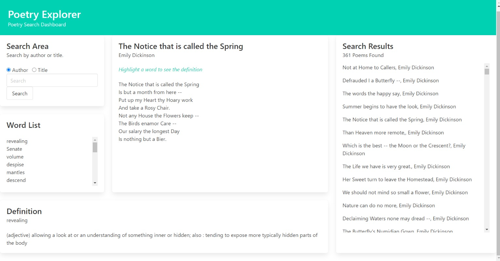

# Poetry Explorer

## Description
This application presents users with a dashboard in which they can search for poetry by author or title. They can then select words within the poem to get definitions. Definitions are displayed at the bottom of the screen and searched words are maintained in a list to act as a vocabulary builder. Technologies used: Javascript, HTML, CSS.

## Team Members and Roles
Coleen Stuhlfire, Technical and design lead
Nichole Fausto, programmer and designer
Julian Almendarez, programmer and designer

## Technology
Javascript, HTML, CSS

## Screen Image

## Links to Application and Github
[Link to Poetry Explorer application](https://cstuhlfire.github.io/PoetryProject/)

[Link to Poestry Explorer Github repository](https://github.com/cstuhlfire/PoetryProject)